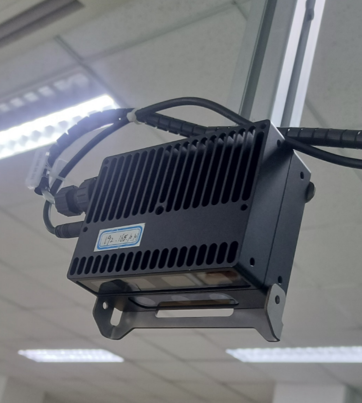
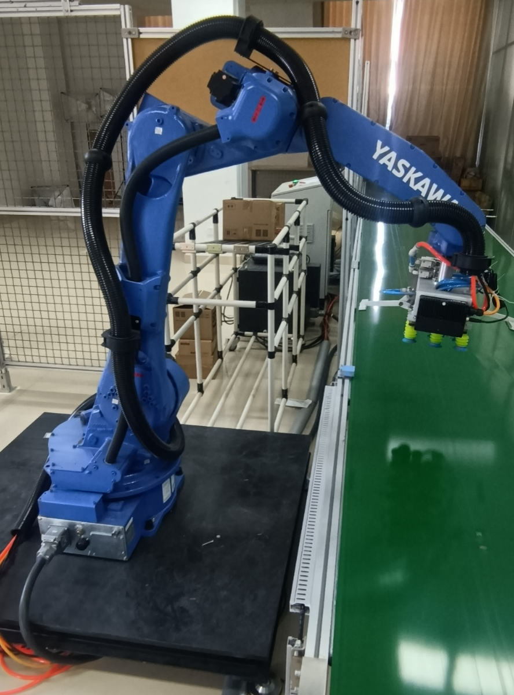
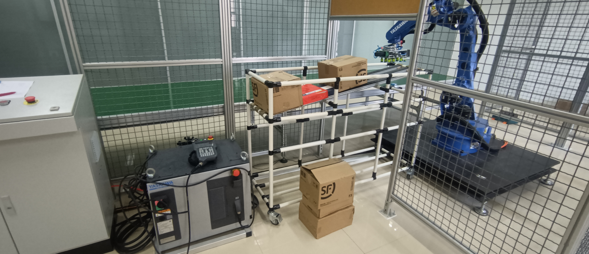

# Industrial_robot
### **内容介绍**

使用MOTOMAN-GP25完成简易物流平台的搭建，完成物流分拣功能。

### **实验平台**

安川机器人MOTOMAN-GP25，是一台6轴垂直多关节型机器人。 通过丰富的功能和核心组件,可满足散装零件抓取、嵌装、组装、打磨、加工等广泛需求。

### **主要步骤**

**视觉模块的识别**：调用 top view 的相机，并完成控制拍照和图片获取。根据得到的图片，将图片中的物体(传送带上的箱子)准确识别出来，并找到其抓取中心。

**机械臂控制**：在机械臂示教器中进行编程。机械臂需要等待接收来自 PC 机的指令，并向PC 机发送自身等待状态。若接收到移动指令，则移动到对应的位置进行抓取，并将物品放置到特定点。若没有指令，则机械臂一直处于等待状态。

**坐标转换**：默认手眼标定已经完成，不需要大家自行标定。大家需要根据已有的标定矩阵，将视觉模块识别到的物体坐标信息转化为机械臂坐标系下。

**信息传递**：完成 PC 机和机械臂之间的双向通讯，要求机械臂可以向 PC 机传送准备就绪信息以及当前位置信息等，PC 机可以向机械臂传送抓取命令等。

