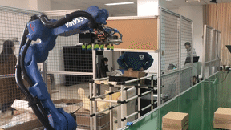

# Industrial_robot



## 项目介绍

### 项目内容

使用MOTOMAN-GP25完成简易物流平台的搭建，通过视觉模块—通讯模块—控制模块联动完成物流分拣功能。

### 实验平台

安川机械臂MOTOMAN-GP25，是一台6轴垂直多关节型机械臂。 通过丰富的功能和核心组件,可满足散装零件抓取、嵌装、组装、打磨、加工等广泛需求。机械臂既可以通过PC编程，也可以通过示教器编程。


## 项目方案

整个项目主要分为视觉模块、通讯模块、控制模块三部分。视觉模块使用opencv识别快递箱所在位置，然后与机械臂通过通讯模块建立socket连接，将位置信息发送给机械臂，控制模块的脚本跑在示教器中，发现位置信息被填充后执行抓取动作。在本项目中，为了演示方便我们只将识别信息划分左中右三种位置。

### 视觉模块

> 代码位置：/code/vision

启动MOTOMAN-GP25后传送带会不断运行，传送带上的物品在经过指定位置时会遮挡传送带两侧的红外线，从而使得传送带停止，机械臂执行抓取动作。我们将摄像头固定在传送带红外线卡位正上方，连接PC使用opencv实现物品识别。识别模块大致流程如下：

1. 监控摄像头输入，等待中断信号；
2. 中断信号来临，执行拍摄；
3. 将图像转换为灰度图；
4. 使用中值滤波过滤噪声；
5. 用canny算法边缘检测；
6. 使用轮廓查找算法获得矩形；
7. 计算矩形在传送带上相对位置并输出。


### 通讯模块

> 代码位置：/code/control

视觉模块获得的数据需要通过socket通信，传送给机械臂。需要以下步骤：

1. 连接网线，设置PC端（server端）的IP地址。
   - 由于机械臂的IP地址为192.168.0.8，因此将PC端的IP地址设置为192.168.0.14（可任意设置，但要保证两者在同一网段）。
   - 由于PC端为server端，因此不设置网关。
   - PC端使用8081端口进行收发数据。

2. 编写机械臂（client端）中运行的程序。使用C语言编程，根据设备提供的api编程，并使用配套IDE编译，编译后的.out文件可在机械臂后台运行。代码内容包括以下几部分：

   - 创建socket，连接server，并向server发送成功信号；
   - 连接成功后，尝试从server读取位置信息并阻塞，直到成功读取；
   - 将读到的位置填充到用户变量槽位；
   - 发送使能信号，执行示教器中写好的脚本；
   - 回到尝试从server读取位置信息并阻塞，一直这样循环下去。

3. 对于PC端（server端），为了方便我们使用socket通信软件（NetAssist）直接进行通信，软件界面如下：

   

### 控制模块

> 代码位置：/code/communication

机械臂的示教器也可通过指令编程，指定机械臂执行流程。当视觉模块的信息通过控制模块传输并使能后，脚本就开始运行。示教器指令编程代码如下：

```bash
NOP
MOVJ P001 VJ=10.00
WAIT BOOO=B0001
TIMER T=0.50
IF(B010=1)THEN
MOVJ P010 VJ=10
ENDIF
IF(B011=1)THEN
MOVJ P011 VJ=10.00
ENDIF
IF(B012=1)THEN
MOVJ P012 VJ=10.00
ENDIF
TIMER T=1.00
DOUT OT#(11) ON //VACUUM_ON
TIMER T=1.00
MOVJ P001 VJ=10.00
TIMER T=0.50
DOUT OT#(11) OFF //VACUMM_OFF
TIMER T=1.00
SET B000 0
SET B010 0
SET B011 0
SET B012 0
END

# 代码说明：
# 1. P为用户变量，其类型为位置变量，MOVJ P001 VJ=10.00为移动到001位置变量表示的位置处，移动速度为10.00。B也为用户变量，其类型为布尔变量，值为0或1。
# 2. P010，P011，P012为可供C语言程序修改的用户变量，分别表示传送带中的三个位置（左中右）。P001提前手工存储了机械臂移动过程中的一个过渡位置。P003提前手工存储了机械臂的目的地，即货架上方。
# 3. 通过IF THEN 命令，判断布尔变量（用于使能，机械臂可利用socket接收到的信息设置3个布尔变量）是否被修改，如果被修改，则移动到对应的传送带处，使用DOUT命令打开吸盘，其中OT#(11)为控制吸盘的寄存器地址。
# 4. TIMER为延时命令。
```


由此，整个视觉模块—通讯模块—控制模块联动，物流分拣功能的系统就完成了。


## 实验心得

在以往的项目中，我们基本只关注某一方面的理论和应用，同时停留在理论证明和软件模拟验证。在这种情况的象牙塔中，各种因素都十分理想，然而实际情况并不会如此。在这个项目中，我们第一次将所学知识应用到真真实实的工业场景中，将不同模块串成一个可用的系统。通过这个项目我们极大地提升了工程编码能力、底层系统能力、复杂工程架构能力、异常情况应对能力。
